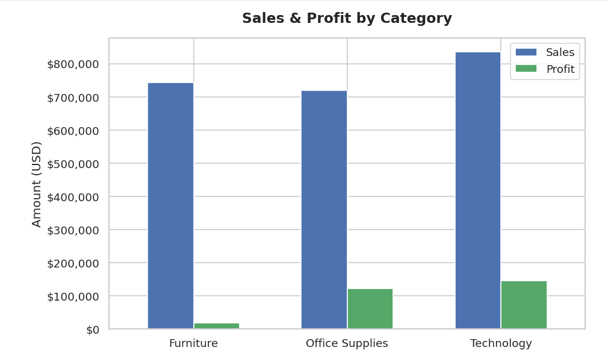
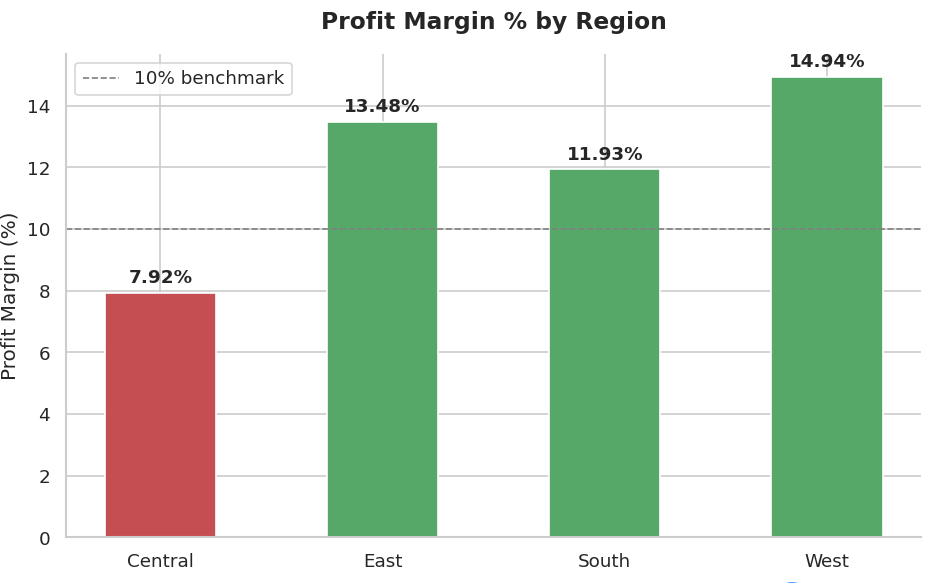
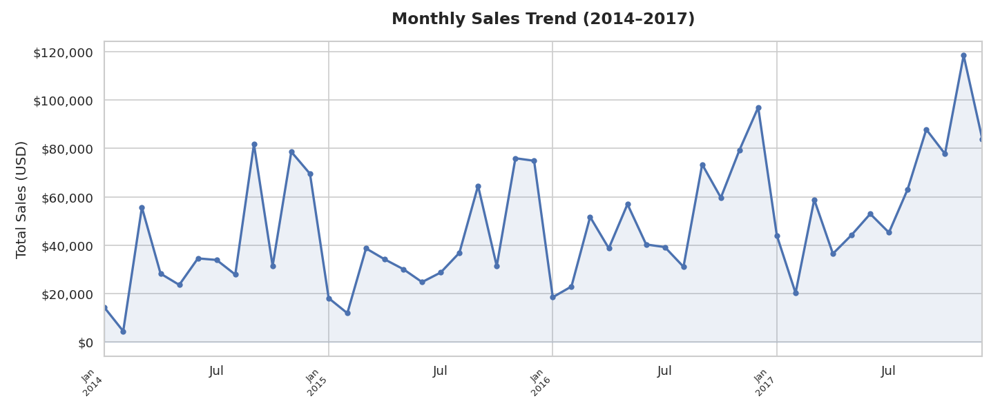
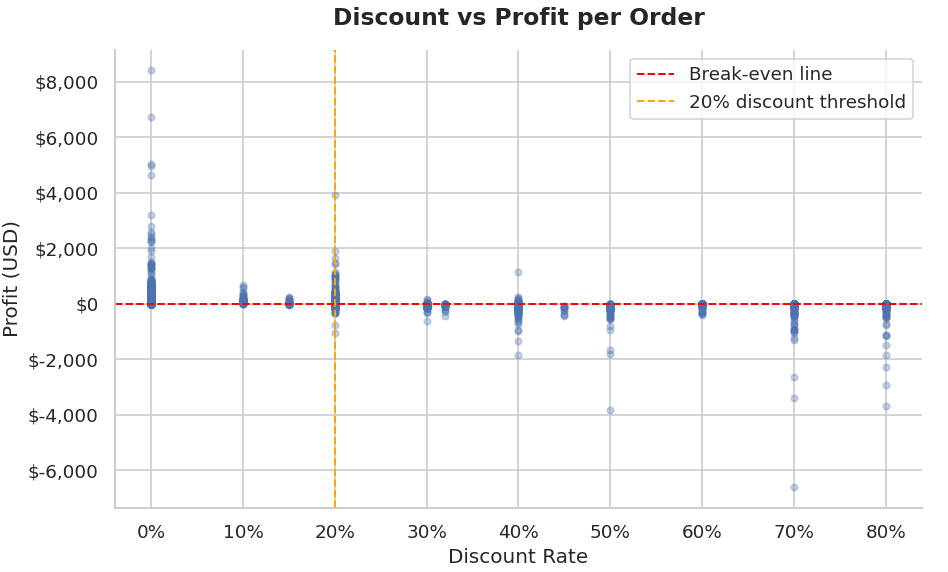

# Superstore Sales Analysis

A complete end-to-end data analysis project using Python and Power BI on the popular Superstore retail dataset. This project covers data cleaning, exploratory data analysis (EDA), Python visualizations, and an interactive Power BI dashboard.

---

## Project Overview

| Detail | Info |
|---|---|
| Dataset | Superstore Sales (9,994 rows × 21 columns) |
| Period | 2014 – 2017 |
| Tools | Python, Pandas, NumPy, Matplotlib, Seaborn, Power BI |
| Environment | Google Colab |

---

## Key Business Insights

1. **Technology leads in profit margin** — Technology category generates the highest profit margin at 17.4%, despite Furniture having similar total sales ($836K vs $742K).

2. **Furniture is a high-risk category** — Furniture has the lowest profit margin at just 2.49% despite being the 2nd highest revenue category. Heavy discounting is the main cause.

3. **Discounts above 20% cause losses** — Any discount rate above 20% results in negative average profit per order. At 50% discount, the average loss is $310 per order.

4. **West region outperforms all others** — West region has both the highest total profit ($108K) and the best profit margin (14.94%). Central region is the weakest at 7.92%.

5. **Strong Q4 seasonality** — November is consistently the peak sales month across all years, driven by holiday season demand. February is always the lowest month.

---

## Python Visualizations

### Sales & Profit by Category


### Profit Margin % by Region


### Monthly Sales Trend (2014–2017)


### Discount vs Profit per Order


---

## Power BI Dashboard

(image.png)

**Dashboard features:**
- KPI cards: Total Revenue ($2.30M), Total Profit ($286.40K), Units Sold (37,873)
- Year slicer to filter all visuals dynamically
- Sales by Category bar chart
- Profit by Region bar chart
- Profit Margin % by Category column chart
- Monthly Sales Trend line chart

---

## Project Structure

```
superstore-sales-analysis/
│
├── Sales_Analysis.ipynb        # Main analysis notebook
├── superstore_cleaned.csv      # Cleaned dataset
├── Superstore_Sales_Dashboard.pbix  # Power BI dashboard file
├── README.md
│
└── charts/
    ├── chart1_category.png
    ├── chart2_region.png
    ├── chart3_monthly_trend.png
    ├── chart4_discount_profit.png
    └── dashboard.png
```

---

## How to Run

1. Clone this repository
2. Open `Sales_Analysis.ipynb` in Google Colab or Jupyter Notebook
3. Upload `superstore_cleaned.csv` to your environment
4. Run all cells in order
5. Open `Superstore_Sales_Dashboard.pbix` in Power BI Desktop

---

## Dataset

- **Source:** [Superstore Dataset on Kaggle](https://www.kaggle.com/datasets/vivek468/superstore-dataset-final)
- **Records:** 9,994 orders
- **Features:** Order details, customer info, product category, sales, profit, discount, region

---

## Tools & Technologies

- **Python 3** — Pandas, NumPy, Matplotlib, Seaborn
- **Google Colab** — Cloud-based notebook environment
- **Power BI Desktop** — Interactive dashboard
- **GitHub** — Version control and portfolio hosting
